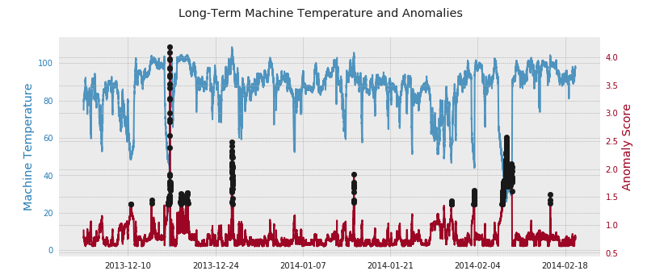
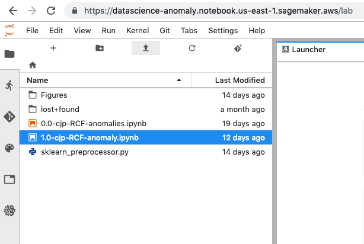
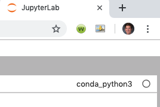

# AWS Inference Pipeline for Anomaly Detection

In this repo, we will be building an [AWS Inference Pipeline](https://docs.aws.amazon.com/sagemaker/latest/dg/inference-pipelines.html) for detecting anomalies in time series data with applications in IoT. To get acquainted with the utility of the inference pipeline, I would encourage you to browse through [this blog post](https://aws.amazon.com/blogs/machine-learning/ensure-consistency-in-data-processing-code-between-training-and-inference-in-amazon-sagemaker/), which provides a high level-overview and a host of great examples.

The dataset that we will be using comes from [Kaggle's Numenta Anomaly Benchmark (NAB)](https://www.kaggle.com/boltzmannbrain/nab/home). Specifically, we'll be working with the `realKnownCause/machine_temperature_system_failure.csv` dataset. In the graph below, you'll see our temperature data, along with the anomaly scores predicted by our Random Cut Forest model.




# Getting up and running locally

1. Clone or download the `anomaly-detection-aws-ip` repo at `https://github.com/collinprather/anomaly-detection-aws-ip.git` on Github.

2. Create an AWS Sagemaker notebook instance. Once it is initiated, click `Open JupyterLab`.

3. In JupyterLab, click on `Upload Files`, and upload `1.0-cjp-RCF-anomaly.ipynb` and `sklearn_preprocessor.py`, which were downloaded in step 1.

<p align="center"> 

</p>

4. Open up `1.0-cjp-RCF-anomaly.ipynb` and in the top right-hand corner, ensure that your notebook kernel is `conda_python3`. If not, click on your kernel and scroll down to choose `conda_python3`.

<p align="center"> 

</p>

5. You're on your way! When inside of a cell, use `shift + enter` to execute code.


# Authenticating and invoking endpoint via API

Using the `boto3` library, we can access the endpoint via API, using the `sagemaker-runtime`. If you are using an AWS SDK to send your requests, then your request will automatically be authenticated by using the access keys provided. Otherwise, your request can be authenticated by way of [HTTP Authorization header](https://docs.aws.amazon.com/AmazonS3/latest/API/sigv4-auth-using-authorization-header.html), or [Query string parameters](https://docs.aws.amazon.com/AmazonS3/latest/API/sigv4-query-string-auth.html).

```python
import boto3

client = boto3.client('sagemaker-runtime')

custom_attributes = "c000b4f9-df62-4c85-a0bf-7c525f9104a4"  # An example of a trace ID.
endpoint_name = "sample-anomaly-endpoint"                   # Your endpoint name.
content_type = "text/csv"                                   # The MIME type of the input data in the request body.
accept = "text/csv"                                         # The desired MIME type of the inference in the response.
payload = "2013-12-02 21:15:00, 75"                         # Payload for inference.


response = client.invoke_endpoint(
    EndpointName=endpoint_name, 
    CustomAttributes=custom_attributes, 
    ContentType=content_type,
    Accept=accept,
    Body=payload
    )

print('The payload recevied an anomaly score of {}.'.format(response['Body'].read()))
# The payload recevied an anomaly score of b'{"scores":[{"score":0.90694374}]}'.
```

We would likely need the client system/application to parse the json response to retrieve the anomaly score of 0.90694374. 


# Invoking endpoint with AWS cli

You can also work with the inference pipeline without recreating all the AWS resources as we do in the notebook. If, instead, you deploy the `inference-pipeline-2019-02-26-21-51-20` model to an endpoint, that endpoint can be invoked from the AWS cli as shown below.

```bash
(datascience-anomaly) bash-3.2$ aws sagemaker-runtime invoke-endpoint --endpoint-name sample-ip-ep --body "2013-12-02 21:15:00, 75" --content-type "text/csv" --accept "text/csv" output.csv
{
    "ContentType": "application/json",
    "InvokedProductionVariant": "variant-name-1"
}
(datascience-anomaly) bash-3.2$ cat output.csv 
{"scores":[{"score":0.90694374}]}
```
